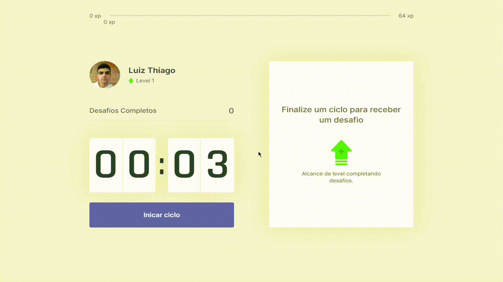

# moveit

[Link do projeto](https://mix-moveit.vercel.app/)

## Descrição

Moveit é um sistema pomodoro para maximizar o foco durante uma atividade que requer grande concentração. Com ele é possível realizar o controle de intervalos para um breve descanso.

Ele conta conta com um sistema níveis e desafios. Quando o contador chega ao fim soa um alarme juntamente com um novo desafio, se ele for cumprido é acumulado mais xp para ir para o próximo nível!

## Ilustração

Obs: O contador é de 25 minutos, está reduzido para exemplo:

 

Criado por: Luiz Thiago  
Suporte: @rocketseat